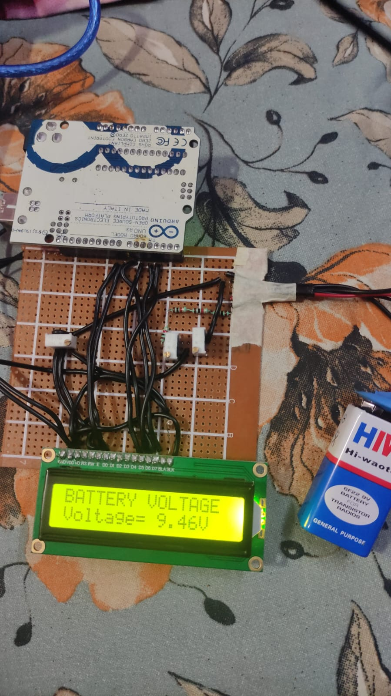

# Digital Voltmeter using Arduino

This project demonstrates how to build a digital voltmeter using an Arduino board and an LCD display. The voltmeter is capable of monitoring the voltage of a battery in real-time.

## Hardware Required

- Arduino board
- 16x2 LCD display
- Resistors (for the voltage divider circuit)
- Voltage divider circuit components (to reduce the battery voltage to a measurable level for the Arduino's analog input pins)
- 5V reference voltage for the Arduino's analog-to-digital converter (ADC)

## Circuit Diagram




## Code Explanation

```cpp
#include "LiquidCrystal.h"

LiquidCrystal lcd(8, 9, 4, 5, 6, 7);

float input_voltage = 0.0;
float temp = 0.0;
float r1 = 5000.0;
float r2 = 1000.0;

void setup()
{
   Serial.begin(9600);     // opens serial port, sets data rate to 9600 bps
   lcd.begin(16, 2);       // set up the LCD's number of columns and rows
   lcd.print("BATTERY VOLTAGE");
}

void loop()
{
   // Conversion formula
   int analog_value = analogRead(A0);
   temp = (analog_value * 5.0) / 1024.0;
   input_voltage = temp / (r2 / (r1 + r2));

   if (input_voltage < 0.1)
   {
     input_voltage = 0.0;
   }

   Serial.print("Voltage: ");
   Serial.println(input_voltage);
   lcd.setCursor(0, 1);
   lcd.print("Voltage=");
   lcd.print(input_voltage);
   lcd.print("V");
   delay(100);
}
```

1. The code begins by including the `LiquidCrystal` library, which provides an interface to control the LCD display.
2. The `LiquidCrystal` object is initialized with the corresponding pin numbers for the LCD display.
3. In the `setup()` function, the serial port is opened and set to a data rate of 9600 bps. The LCD display is also initialized with the number of columns and rows, and a message is printed to indicate that the voltmeter is monitoring the battery voltage.
4. The `loop()` function continuously performs the following steps:
    * Reads the analog value from the voltage divider circuit using the `analogRead()` function.
    * Converts the analog value to voltage using the formula: `temp = (analog_value * 5.0) / 1024.0`.
    * Calculates the battery voltage using the formula: `input_voltage = temp / (r2 / (r1 + r2))`.
    * Checks if the input voltage is less than 0.1V, and if so, sets it to 0.0V.
    * Prints the voltage value to the serial monitor.
    * Updates the LCD display with the voltage value.
    * Adds a delay of 100 milliseconds to prevent rapid flickering of the display.

Usage
-----

1. Connect the Arduino board to a power source.
2. The LCD display will show the battery voltage in real-time.
3. You can also monitor the voltage values through the serial monitor in the Arduino IDE.

License
-------

This project is licensed under the [MIT License](LICENSE).

